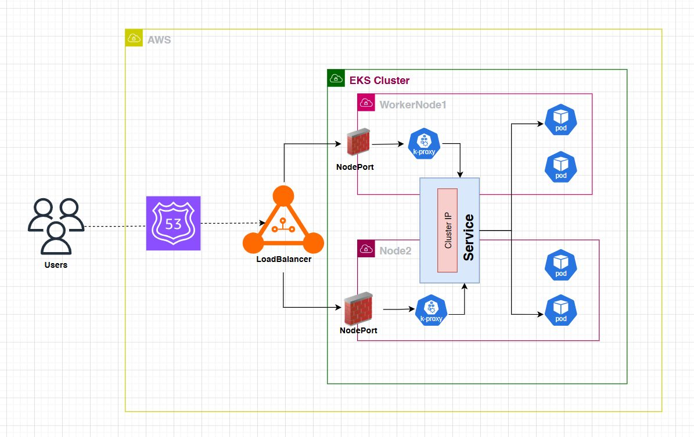

# 🚀 How Traffic Really Flows in Kubernetes (EKS)

 Most people assume a LoadBalancer talks directly to a Service.
 ❌ But that’s not how Kubernetes works.

## Here’s the real traffic path 👇

Client → Route53 → LoadBalancer → NodePort → kube-proxy → Service (ClusterIP) → Pods

Pic 


```bash
 🔸 Client hits the Route53 DNS
 🔸 Route53 resolves to the AWS LoadBalancer
 🔸 LoadBalancer forwards traffic to any worker node
 🔸 NodePort on that node receives the request
 🔸 kube-proxy routes it internally
 🔸 Service distributes traffic across backend pods
 🔸 Pods can run on any node in the cluster
```
```bash
This is how Kubernetes ensures:
 ⚡ High availability
 ⚡ Internal load balancing
 ⚡ Seamless scaling

Simple flow. Powerful architecture. 🚀
```
---