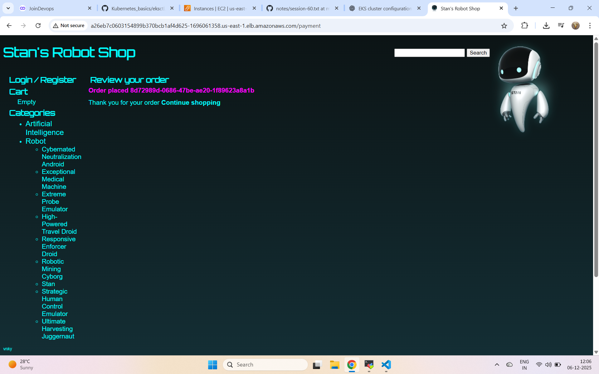

# Roboshop Kubernetes Deployment – README


## 📌 Deployment Order

Apply resources in the following order:

```bash
kubectl apply -f namespace.yml
kubectl apply -f mongodb/manifest.yml
kubectl apply -f redis/manifest.yml
kubectl apply -f mysql/manifest.yml
kubectl apply -f rabbitmq/manifest.yml
kubectl apply -f catalogue/manifest.yml
kubectl apply -f cart/manifest.yml
kubectl apply -f user/manifest.yml
kubectl apply -f shipping/manifest.yml
kubectl apply -f payment/manifest.yml
kubectl apply -f frontend/manifest.yml
```

---

## ✔ Notes
- The namespace must be created first.
- Apply database and backend services before frontend.
- Ensure all manifests are updated with correct image versions and environment variables.

---

Deployment is now ready. Run:

```bash
kubectl get pods -A
kubectl get svc -A
```


Pic 

